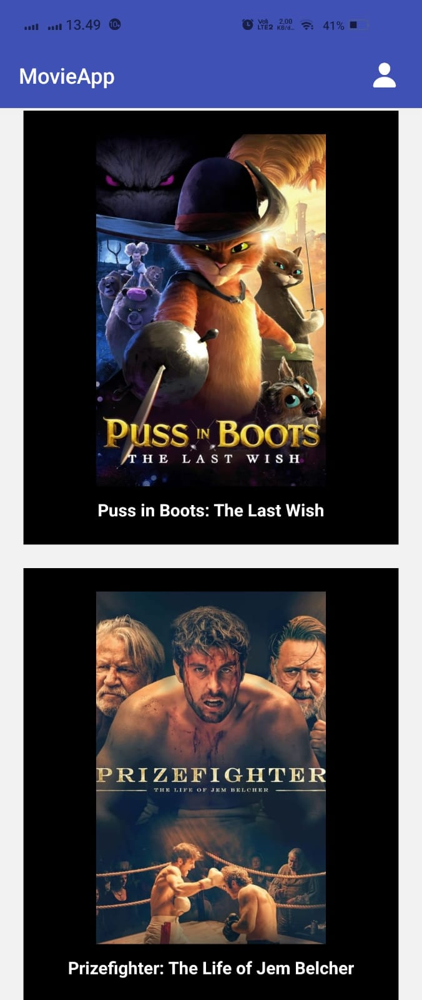
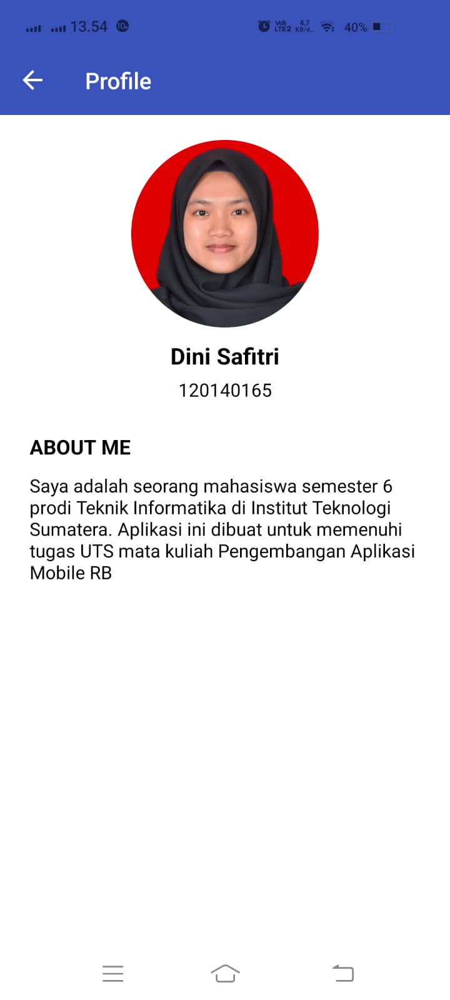

# UTS-PAM (movieApp)

### Description
movieApp adalah sebuah aplikasi yang memungkinkan pengguna untuk mencari informasi tentang film yang sedang populer

### Dependencies

- React Native
- React Navigation
- React Native Stack
- API

### How to run this app

1. Clone this repository

```bash
https://github.com/Diindnn/UTS-PAM 
```

2. Install all dependencies

```bash
npm install / npm install --global expo-cli
```
```bash
npm install @react-navigation/native @react-navigation/stack
```

3. Run the app

```bash
npm start / expo start --tunnel
```

4. Open the app

```bash
Open the app using Expo Go on your phone. Scan the QR code on the terminal or in the browser.
```

### How to build this app

1. Install Expo CLI

```bash
npm install -g expo-cli
```

2. Build the app

```bash
expo build:android
```

3. Download the app

```bash
Download the app from the link that is given on the terminal.
```

## Screenshot







### Cara mendapatkan API Key di TMBd untuk aplikasi ini

- Buat akun di situs web TMDb (https://www.themoviedb.org/signup).
- Setelah berhasil login, kunjungi halaman https://www.themoviedb.org/settings/api untuk mendapatkan API key.
- Klik tombol "Create" untuk membuat API key baru.
- Isi formulir untuk memilih jenis API key yang ingin Anda buat (Developer atau Commercial), beri nama pada API key Anda, dan berikan deskripsi tentang penggunaan API key tersebut.
- Setelah berhasil membuat API key, TMDb akan menampilkan API key tersebut di halaman tersebut dan akan mengirimkan API key tersebut melalui email
- Gunakan API key tersebut untuk mengakses layanan API TMDb.

## Author

Dini Safitri - 120140165

